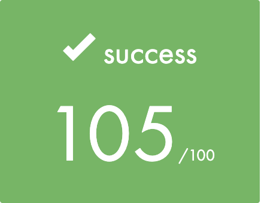

# So_Long-42Quebec

## Subject

<a href="https://github.com/yanislabbe/So_Long-42Quebec/blob/main/requirement/So_Long-Subject-FR-42Quebec.pdf">Subject</a>

## Usage

``make`` without bonus features.

``make bonus`` to compile with bonuses.

## Results

	

